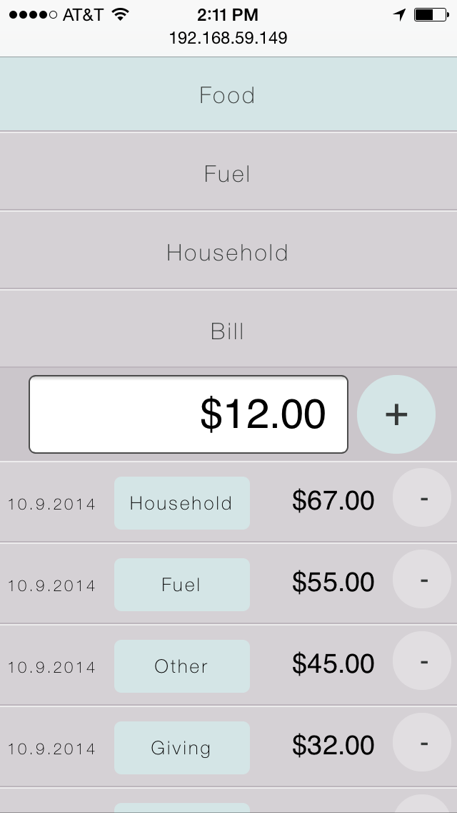

tracker
=========

tracker is a very soon to be renamed mobile web app to track financial transations in the fastest and easiest possible way. tracker uses PouchDB to create a local database in your browser, then when possible it syncs with a remote CouchDB. The sync works both ways so any transactions logged uisng the app will end up in all databases.
The goal of the project is to provide a simple interface to log spending independant of how the transaction was made (cash, credit, debit, etc.)

---

---

Goals
---

* <s>Simple and clean UI/UX</s>
* <s>Easy to navigate list of expendature types (food, gas, bill, etc)</s>
* <s>Log transation in a simple flow</s>
* Easy to navigate transation history by day, week, month

Tasks
---

* <s>Make remove buttons work</s>
* <s>Store data</s>
* day - week - month - year seperators
* security
* accounts?

Decisions to make
---

* <s>How to store the data</s>
* How to do security
* How to create user accounts
